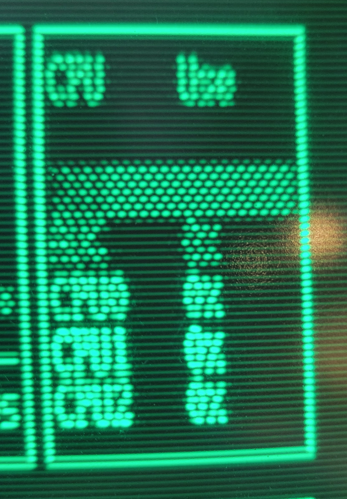
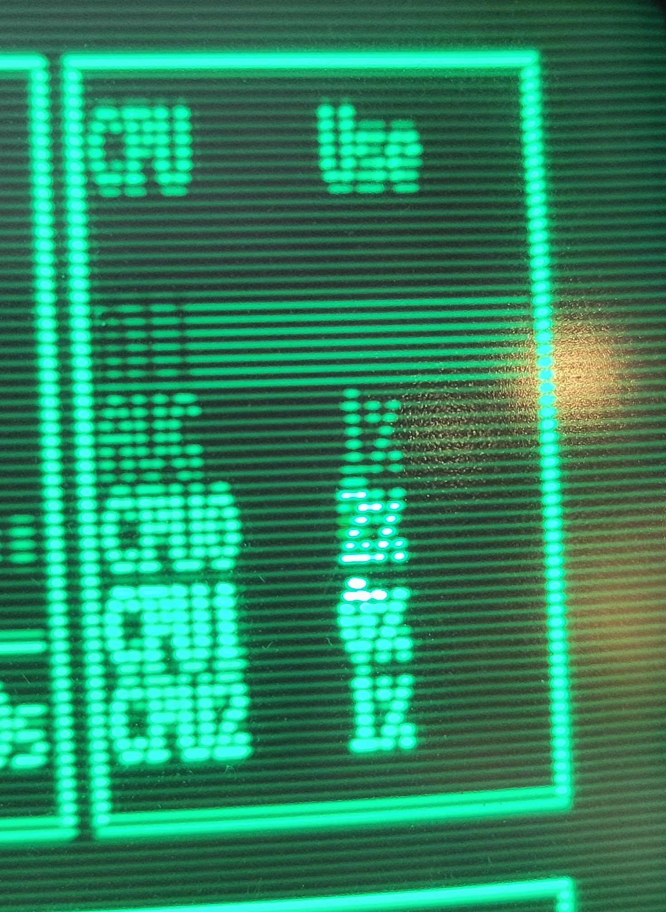

# pivec
Simple user mode app to configure the Raspberry PI composite video controller. This application disables both the color burst and modulated chrominance signal. It solves the problem described in this [thread on the raspberry pi forums](https://forums.raspberrypi.com/viewtopic.php?t=248217). This will enable higher resolution without the annoying moving dithering when connecting an old monochrome CRT with composite input to the Raspberry PI. This app has been tested with the Raspberry PI 4 and PI zero 2w. It's expected to work with the PI 1, 2, 3, zero. It will not work with the PI 5 without some modification since this feature has been moved to the new PI southbridge.

## The Problem
This is what vintage composite monochrome monitor looks like just setting sdtv_disable_colourburst=1 in the config.txt file.



## Solved
This is the same vintage composite monochrome monitor using pivec to set



## Download
```
suho apt update
sudo apt install git make
git clone https://github.com/racerxr650r/pivec
```

## Install
```
cd pivec
make install
```

## Run the App
You have to run the application with root permissions.
```
sudo pivec -v -c off
```

## Usage
```
Usage: pivec [OPTION]

Simple user mode app to configure the Raspberry PI composite video controller.
Use this application to disable the color burst and modulated chroma signal.
This application is helpful if you are using an old monochrome CRT with composite
input and you want higher resolution without the annoying dithering. This
app has been tested with the Raspberry PI 4 and PI zero 2w. It's expected to work
with the PI 1, 2, 3, zero. I expect it will not work with the PI 5 without some
modification since this feature has been moved to the new PI southbridge.

OPTIONS:
  -c   on|off
       Turn the color burst and chrominance on or off (default:off)
  -h/? Display this usage information
  -v   Verbose mode, displays configuration status
```

## Setup to Run at Boot Time
```
make boot
```

> [!TIP]
> To reduce screen burn in, add consoleblank=60 to the cmdline.txt file. This will blank the console video after 1 minute of inactivity.
